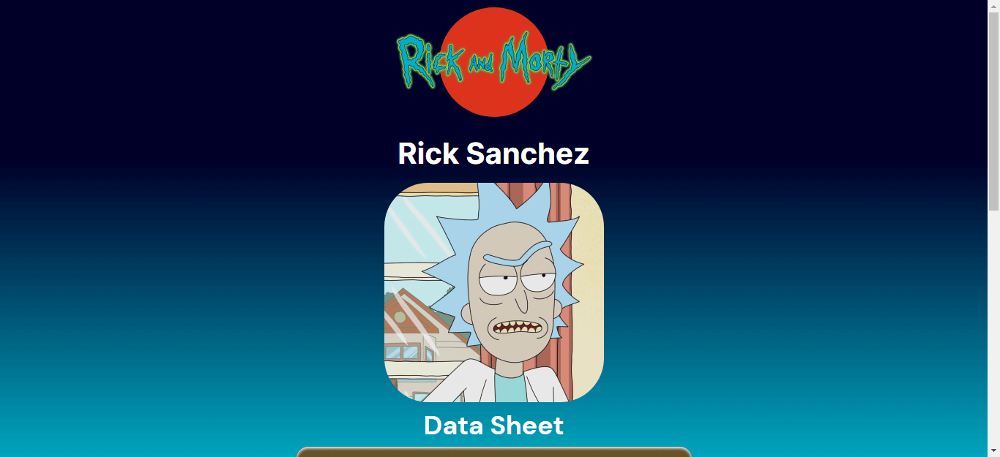

# Rick and Morty Data Sheet

Una aplicación hecha con JavaScript vanilla, HTML y CSS, responsiva. Consume el API https://rickandmortyapi.com/ para traer uno a uno los personajes de la serie y mostrar sus datos.

Tecnologías utilizadas: HTML, CSS, JavaScript, Git/Github

## Comenzando 🚀

Utilizando los botones interiores o las flechas (derecha e izquierda) del teclado, ira cambiando entre los distintos personales del api, como si se estuviera camiando la página. Cada vez que cambia de personaje se le está haciendo una nueva petición al API.

## Despliegue 📦

Pueder ver la página en esta url: https://dbriceno10.github.io/proyecto-con-api-de-rick-and-morty/

